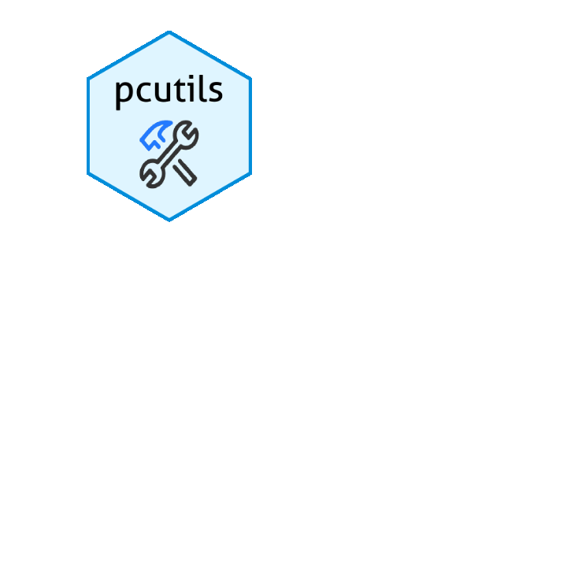

  <!-- 顶部青绿动态波浪头图 -->
  

  <!-- 动态打字效果 -->
  

    
  

  <!-- 个人资料与学术名片徽标 -->
  

    
    
    
    
    
    
    
  

  <!-- 贪吃蛇代码贡献图（自动适配浅色 / 深色模式） -->
  <picture>
    <source media="(prefers-color-scheme: dark)" srcset="https://raw.githubusercontent.com/Asa12138/Asa12138/output/github-contribution-grid-snake-dark.svg" />
    <source media="(prefers-color-scheme: light)" srcset="https://raw.githubusercontent.com/Asa12138/Asa12138/output/github-contribution-grid-snake.svg" />
    
  </picture>

<table>

<tr><td>

### 🤺 About Me

I am currently pursuing a PhD in Bioinformatics at Zhejiang University.

🎯 **Focus on**

- 🧬 **Metagenomics and microbial ecology**: mechanisms shaping microbial diversity patterns, distribution and dynamics.
- 💻 **Bioinformatics and systems biology**: developing ecological network or other mathematical modeling approaches for microbial ecology.

📥 **Contact me**

- 📩 Email: <pengchen2001@zju.edu.cn>
- 🏠 Personal website: <https://asa12138.github.io/>
- 🆔 ORCID: <https://orcid.org/0000-0002-9449-7606>

</td></tr>

<tr><td>

### 🏫 Education Experience

- [Zhejiang University, Life Sciences Institute](http://www.cls.zju.edu.cn/clscn/) &emsp; 📌 2022-07-01 —— Now
  - PhD student · Major: Bioinformatics
- [Zhejiang University, College of Life Sciences](http://www.cls.zju.edu.cn/clscn/) &emsp; 📌 2018-09-01 —— 2022-06-30
  - Undergraduate · Major: Biological Science

</td></tr>

<tr><td>

### 🤩 Interests

- 📺 **Animation**: [Attack on Titan](https://zh.wikipedia.org/wiki/%E9%80%B2%E6%93%8A%E7%9A%84%E5%B7%A8%E4%BA%BA), [CLANNAD](https://zh.wikipedia.org/wiki/CLANNAD), and [Rick and Morty](https://en.wikipedia.org/wiki/Rick_and_Morty).
- 🦉 [**Bird watching**](http://106.14.57.216:5000/)
- 🌼 [**Plant cognition**](http://site.nsii.org.cn/App/IdentTest/)

</td></tr>

<tr><td>

### 🧑‍💻 Skills & R Packages

  

My favorite programming language is **R**. I have developed and maintain the following CRAN R packages:

| Package | Description | Stats |
| :--- | :--- | :--- |
| [**MetaNet**](https://github.com/Asa12138/MetaNet) | Comprehensive multi-omics network analysis |   |
| [**pcutils**](https://github.com/Asa12138/pcutils) | Useful utilities for statistics & visualization |   |
| [**pctax**](https://github.com/Asa12138/pctax) | Helpful functions for microbiome & taxonomy analysis |   |
| [**ReporterScore**](https://github.com/Asa12138/ReporterScore) | Generalized Reporter Score-based Enrichment Analysis |   |
| [**plot4fun**](https://github.com/Asa12138/plot4fun) | Interesting & creative functions for plotting |   |

</td></tr>

<tr><td>

### 📊 GitHub Analytics

  

</td></tr>

</table>
