  <!-- dynamic typing effect 动态打字效果 -->
  

    
  

  <!-- for beauty 留个空行好看点 -->
  
&nbsp;

  <!-- profile logo 个人资料徽标 -->
  

    &emsp;
    &emsp;
    &emsp;
    &emsp;
    &emsp;
    &emsp;
    <!-- visitor statistics logo 访问量统计徽标 -->
    
  

  <!-- Snake Code Contribution Map 贪吃蛇代码贡献图 -->

### Hi there 👋

<table>
  
<tr><td>

### 🤺 About Me

I am currently pursuing a PhD in bioinformatics at Zhejiang University. 

🎯 Focus on 

- 🧬 Metagenomics and microbial ecology: mechanisms shaping microbial diversity patterns, distribution and dynamics. 
- 💻 Bioinformatics and systems biology: developing ecological network or other mathematical modeling approaches for microbial ecology.

📥 Contact me

- 📩 Email <pengchen2001@zju.edu.cn>
- 🏠 Personal website <https://asa12138.github.io/>

</td></tr>

<tr><td>

### 🏫 Education Experience

- [Zhejiang University, Life Sciences Institute](http://www.cls.zju.edu.cn/clscn/) &emsp; 📌 2022-07-01 —— Now

  - PhD student
  - Major: Bioinformatics

- [Zhejiang University, Colleage of Life Sciences](http://www.cls.zju.edu.cn/clscn/) &emsp; 📌 2018-09-01 —— 2022-06-30

  - Undergraduate
  - Major: Biological Science

</td></tr>

<tr><td>

### 🤩 Interests

-   📺 Animation
    Such as [Attack on Titan](https://zh.wikipedia.org/wiki/%E9%80%B2%E6%93%8A%E7%9A%84%E5%B7%A8%E4%BA%BA), [CLANNAD](https://zh.wikipedia.org/wiki/CLANNAD), and [Rick and Morty](https://en.wikipedia.org/wiki/Rick_and_Morty).

-   🦉 [Bird watching](http://106.14.57.216:5000/)

-   🌼 [Plant cognition](http://site.nsii.org.cn/App/IdentTest/)

</td></tr>

<tr><td>

### 🧑‍💻 Skills

<!--  skill badge 技能徽章 -->

<!-- programming tool icon 编程工具图标 -->
 

My favorite programming language is R, I have developed some R packages:

- [pcutils](https://github.com/Asa12138/pcutils): It contains many useful tools or functions for statistics or visualization.
- [MetaNet](https://github.com/Asa12138/MetaNet): It is a comprehensive network analysis package, especially in various biological omics.
- [pctax](https://github.com/Asa12138/pctax): It contains some helpful functions for microbiome analysis.
- [ReporterScore](https://github.com/Asa12138/ReporterScore): Generalized Reporter Score-based Enrichment Analysis for Omics Data.
- [plot4fun](https://github.com/Asa12138/plot4fun): It provides many interesting functions for plotting.

</td></tr>

<tr><td>

### 📊 GitHub Analytics

<!-- GitHub 数据统计 -->

 

</td></tr>

</table>
